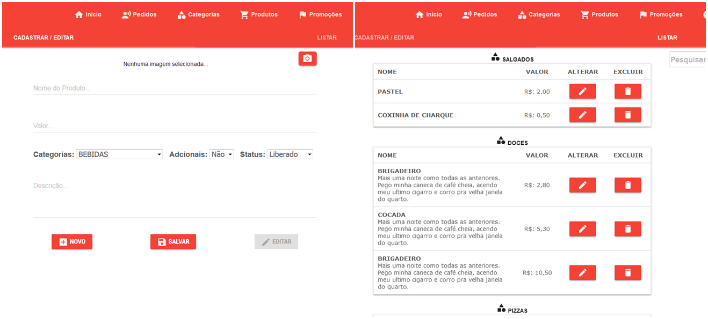

## Projeto - Delivery

###  :computer: Tela

  

----------

### :hammer_and_wrench: Ferramentas
As seguintes tecnologias foram utilizadas na construção do projeto:
- HTML;
- JavaScript;
- CSS;
- Material Design;
- Banco de Dados Firebase.

----------

###  :gear: Funções
- [x] Projeto para serviço delivery, gerenciando pedidos pelo aplicativo.
- [x] CRUD de Categorias;
- [x] CRUD de Produtos;

----------

###  :construction: Projeto em Construção

----------

###  :eyeglasses: Autor
José Gustavo da Silva.
[
**Linkedin**
](https://www.linkedin.com/in/jose-gustavo312/)